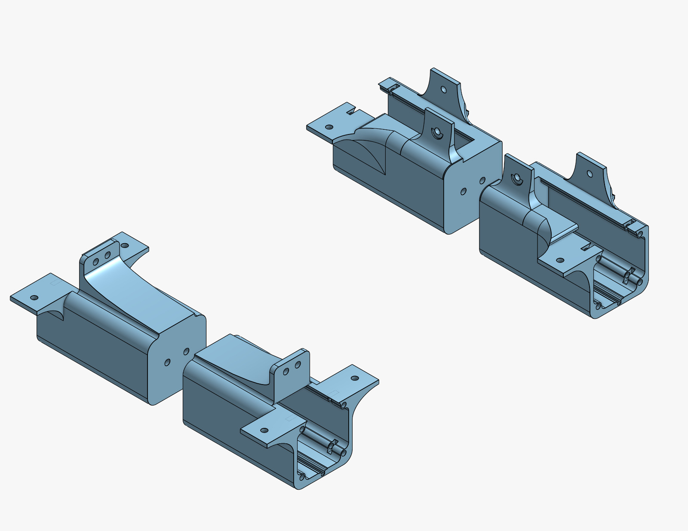
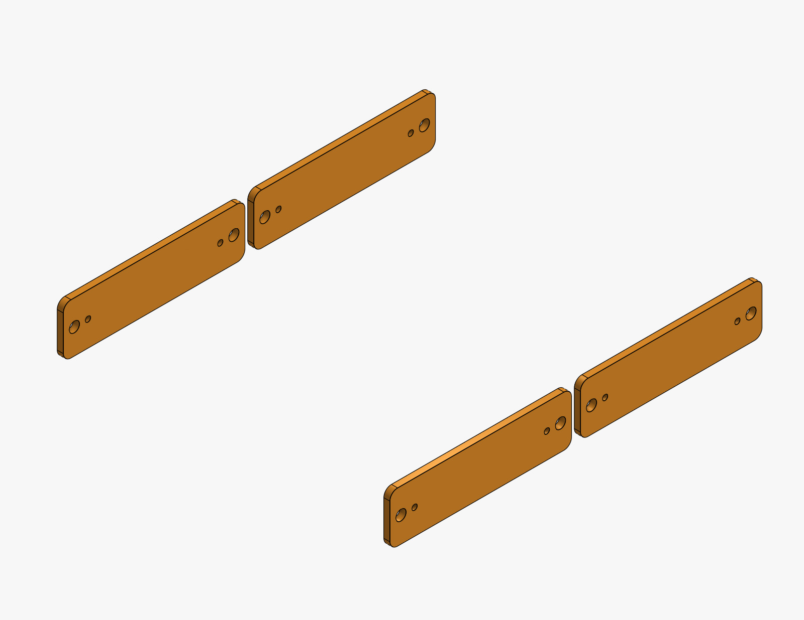
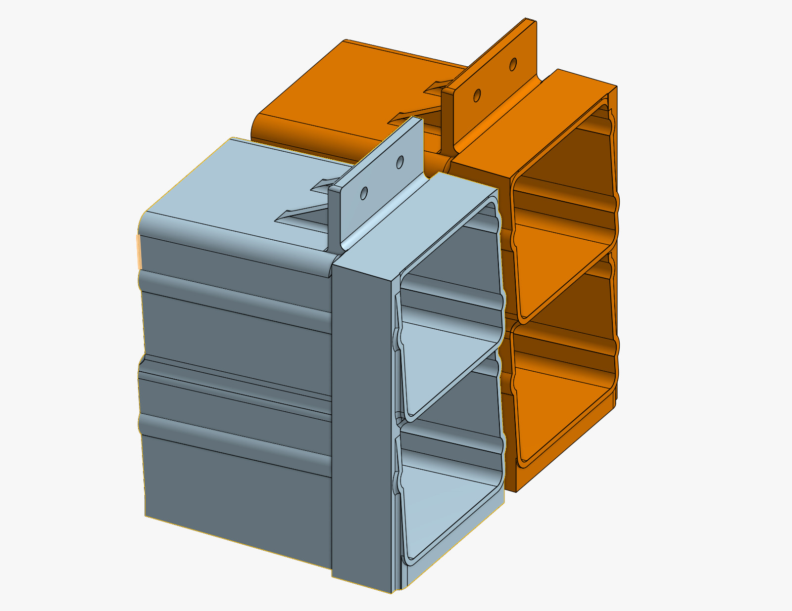
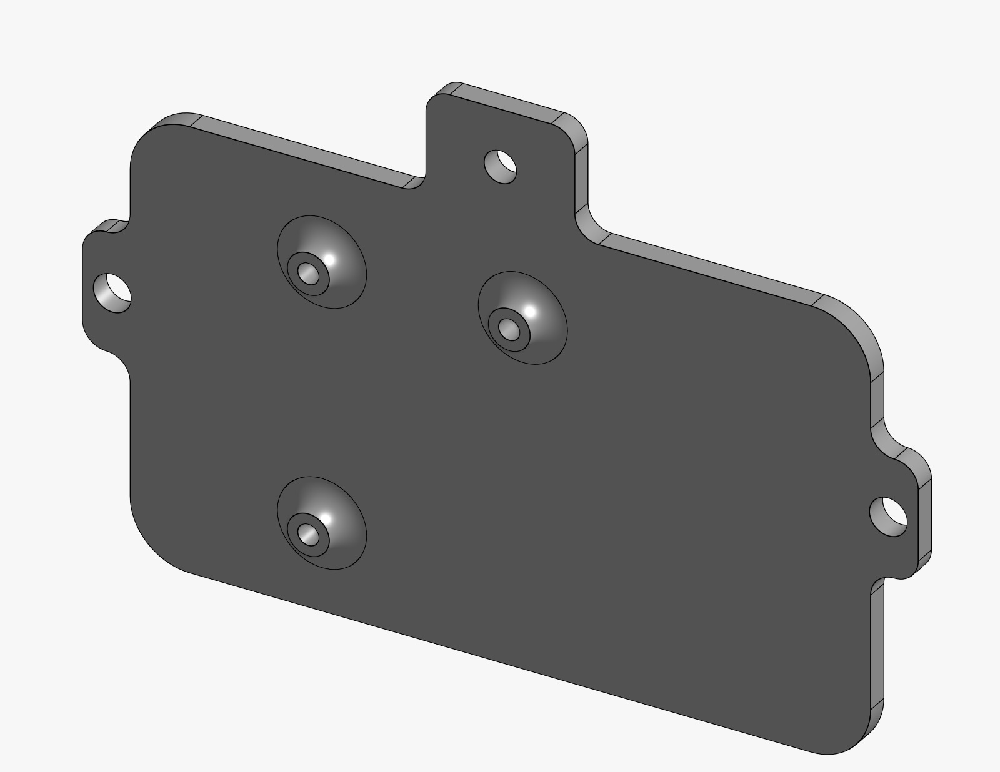
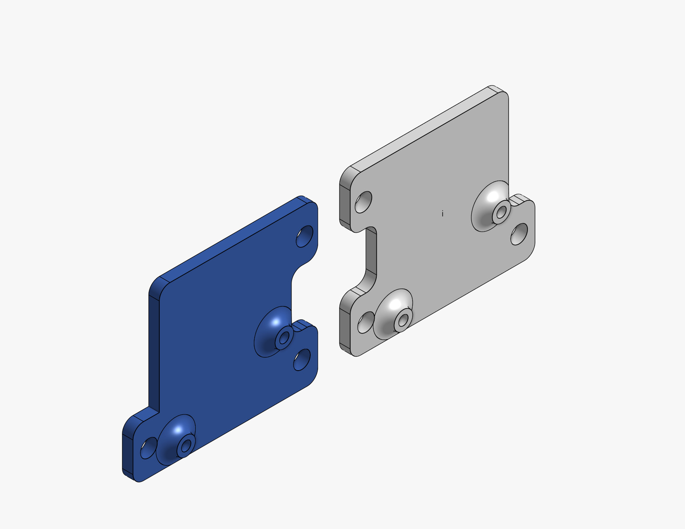
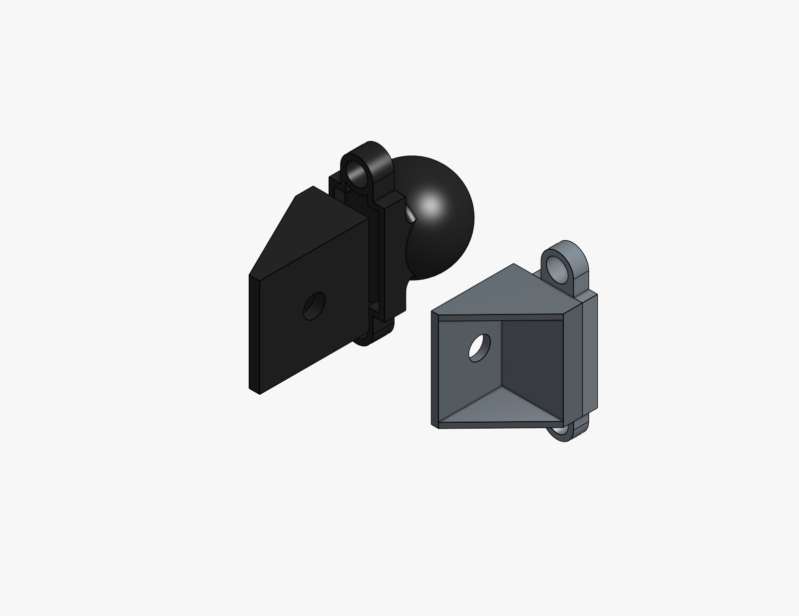
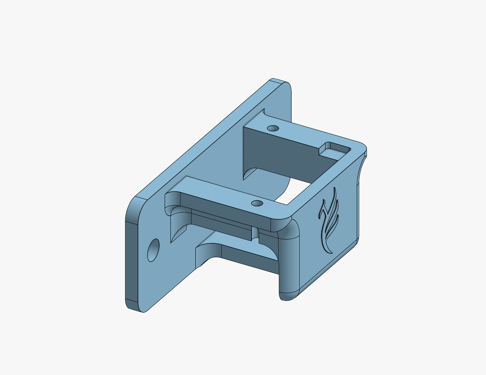

# 🖨️ Impressão 3D

<div style="text-align: justify;">

Esta seção apresenta os componentes imprimíveis em 3D utilizados no robô MICKY. Todas as peças foram projetadas para suportar a estrutura mecânica e facilitar a integração com componentes eletrônicos, mantendo baixo custo e facilidade de fabricação.

## [Baixe os modelos 3D aqui](https://github.com/fbot-research/open_micky/tree/main/hardware)

## Antes de imprimir

> Assume-se que você possui experiência básica com impressoras 3D de nível consumidor (K1 Max, Ender 3, etc.). Isso significa que você sabe como imprimir corretamente arquivos STL utilizando filamento PLA, além de estar familiarizado com reorientação de peças, adição de suportes, ajuste de preenchimento (infill) e modificação da velocidade de impressão para alcançar o equilíbrio desejado entre resistência mecânica, eficiência e qualidade do modelo.
>

- Todas as peças impressas em 3D mostradas nas imagens do MICKY foram produzidas utilizando uma **Creality K1 Max com filamento PLA Speed Premium Orange**.
- Recomenda-se a secagem do PLA em ambientes úmidos a 45 °C por 8 horas antes da impressão.

---

## Suporte do Motor das Rodas



Este componente fixa os motores das rodas à estrutura do robô, garantindo alinhamento adequado e estabilidade durante a operação. Ele foi projetado para suportar os esforços mecânicos gerados pelo sistema de locomoção, mantendo facilidade de instalação e substituição. Um perfil de alumínio é posicionado entre cada par de suportes de motor para reforçar a estrutura e aumentar a rigidez geral.

---

## Suporte do Driver



Esta peça fornece uma interface dedicada para fixação dos drivers dos motores, mantendo-os firmemente presos à estrutura. Além disso, garante melhor organização e acessibilidade para cabeamento e manutenção.

---

## Suporte de Bateria



Este componente mantém as baterias posicionadas corretamente, oferecendo suporte estrutural e proteção durante a operação. O design garante estabilidade e fácil acesso para instalação e substituição.

```{note}
O projeto do robô prevê espaço para quatro baterias, sendo duas dedicadas exclusivamente ao sistema de locomoção, enquanto as outras duas podem ser utilizadas para alimentar um computador externo, se necessário.
```

---

## Suporte da Placa Arduino



Este suporte fixa a placa Arduino à estrutura do robô, proporcionando uma base estável para controle e comunicação. O design permite fácil acesso às portas e conexões.

---

## Suporte da Placa de Drivers



Este componente é utilizado para montar e organizar as placas de controle dos drivers, garantindo posicionamento adequado e fixação segura. Também facilita o gerenciamento de cabos e a manutenção do sistema.

---

## Suportes Estruturais



Esses componentes reforçam a estrutura geral do robô, aumentando a rigidez e a estabilidade mecânica. Foram projetados para distribuir cargas e manter o alinhamento entre os módulos.

---

## Suporte do Botão de Emergência



Este suporte fornece uma interface segura para a instalação do botão de parada de emergência, garantindo que ele permaneça acessível e firmemente fixado. Sua posição permite uma interação rápida e confiável em situações críticas.

---

### Considerações de Custo

* **Impressora própria** (recomendado): Todas as peças podem ser produzidas em impressoras 3D de nível consumidor, como a Creality K1 Max (~$899 USD).
* **Custo do filamento**: Aproximadamente $38–55 USD para o PLA necessário.

</div>