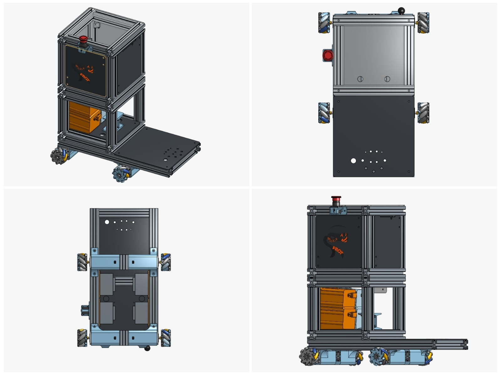
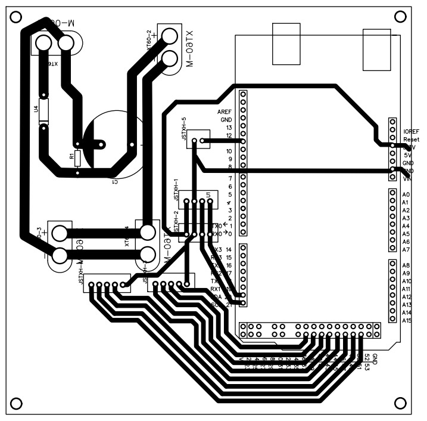
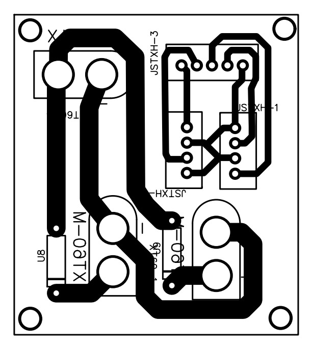
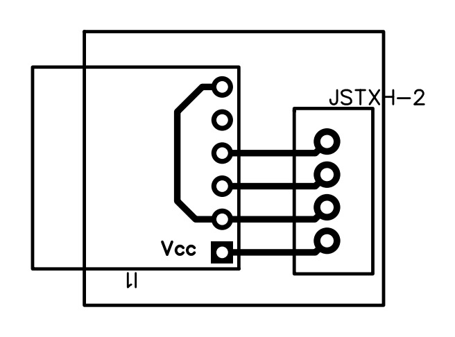
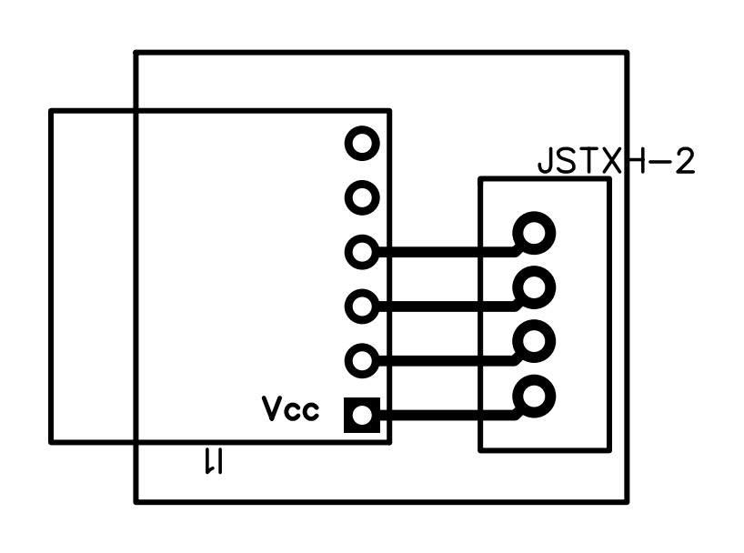

# ⚒️ Montagem

<div style="text-align: justify;">



Esta seção descreve o processo de montagem do robô MICKY, incluindo a construção mecânica, fabricação das placas de circuito impresso (PCB) e integração eletrônica.

---

## Montagem Mecânica

Esta seção mostra a montagem mecânica do robô MICKY.

<iframe width="800" height="600" 
    src="https://www.youtube.com/embed/L_kPBL3wr8g"
    frameborder="0" 
    allowfullscreen>
</iframe>

---

## Montagem Eletrônica

Esta seção descreve a montagem elétrica do robô, incluindo a fabricação das PCBs, cabeamento e integração dos componentes eletrônicos.

### Fabricação das PCBs

Esta seção descreve o processo utilizado para fabricar as Placas de Circuito Impresso (PCBs) desenvolvidas para o robô MICKY. As placas foram produzidas utilizando um método de baixo custo e acessível, permitindo fácil replicação sem a necessidade de equipamentos especializados.

### Materiais Necessários

- Placa cobreada
- Papel fotográfico
- Solução de cloreto férrico
- Superfície geradora de calor
- Marcador permanente

### Processo de Fabricação

1. **Impressão do layout da PCB**  
   Imprima o design da PCB em escala 1:1 em papel fotográfico.

2. **Transferência do layout**  
   Posicione o layout impresso com a face voltada para baixo sobre a placa cobreada.
   Aplique calor e pressão utilizando um ferro de passar para transferir a tinta para a superfície do cobre.

3. **Remoção do papel**  
   Remova cuidadosamente o papel fotográfico utilizando um fluxo leve de água.

4. **Correção de imperfeições**  
   Utilize um marcador permanente para corrigir trilhas interrompidas.

5. **Processo de corrosão**  
   Submerja a placa na solução de cloreto férrico para remover o cobre exposto.

6. **Limpeza e acabamento**  
   Limpe e lixe a placa para remover a tinta.
   A PCB estará pronta para soldagem.

---

### Placas Personalizadas

Essas placas foram projetadas para simplificar a integração do sistema e garantir distribuição de energia confiável e conectividade de sinais em toda a plataforma. Cada placa atende a um subsistema específico, contribuindo para uma arquitetura modular e de fácil manutenção.

#### Placa de Interface do Arduino

- Arduino Mega 2560
- Capacitor (63 V / 4700 µF)
- Resistor (3,3 kΩ)
- Diodo de 20 A
- Conectores XT60 (4x)
- Conectores JST-XH de 5 pinos (2x)
- Conectores JST-XH de 4 pinos (2x)
- Conector JST-XH de 2 pinos



---

#### Placa dos Drivers de Motor

- Diodos de 20 A (2x)
- Conectores XT60 (3x)
   - 1x macho
   - 2x fêmea
- Conector JST-XH de 5 pinos
- Conectores JST-XH de 4 pinos (2x)



---

#### Placa da IMU

- Conector JST-XH de 4 pinos
- IMU MPU9250

<div align="center">


</div>

Para suportar o uso de duas IMUs no sistema, ambas as PCBs foram projetadas para simplificar sua integração com o restante da eletrônica. Porém, como ambos os sensores compartilham o mesmo barramento de comunicação, é necessário diferenciá-los através do endereçamento I2C.

Isto é conseguido modificando a configuração do pino AD0: uma das placas IMU inclui um traço externo conectando o pino AD0 ao GND, alterando seu endereço I2C, enquanto a outra mantém a configuração interna padrão.

---

```{important}
O cloreto férrico é corrosivo. Utilize sempre equipamentos de proteção e trabalhe em um ambiente ventilado.
```

</div>