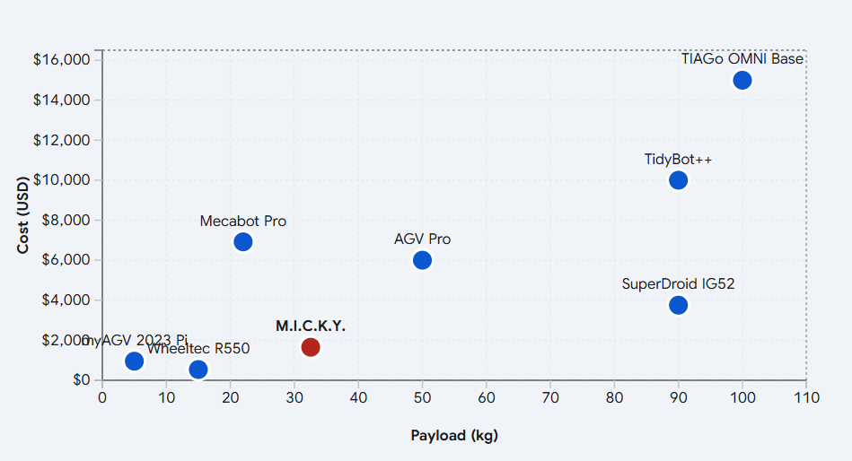

# 📊 Análise Comparativa

## Introdução

O desenvolvimento de plataformas robóticas acessíveis e de baixo custo ainda representa um desafio crítico para equipes que desejam ingressar em ambientes competitivos e de pesquisa, como o RoboCup@Industrial, especialmente em regiões com recursos limitados, como a América Latina. Os altos custos associados às bases móveis comerciais frequentemente criam uma barreira significativa de entrada, restringindo a participação e desacelerando a inovação.

Nesse contexto, apresentamos a base móvel MICKY, uma plataforma robótica omnidirecional projetada especificamente para reduzir essa barreira, priorizando eficiência de custo sem comprometer a capacidade mecânica. A plataforma adota uma arquitetura modular baseada em perfis de alumínio industriais de 40×40 mm e um sistema de tração com rodas Mecanum, permitindo movimento holonômico e suportando cargas úteis significativas.

Em vez de depender de soluções proprietárias caras, o MICKY é construído utilizando componentes comerciais prontos para uso (COTS) e um design mecânico simplificado. Essa abordagem permite que a plataforma alcance uma alta relação carga útil/custo, mantendo-se acessível, de fácil manutenção e adaptável a diferentes aplicações.

O sistema foi projetado para suportar manipulação móvel, navegação autônoma e pesquisa em robótica de propósito geral, além de permitir a integração direta de sensores, atuadores e subsistemas adicionais. Sua modularidade garante que a plataforma possa evoluir de acordo com as necessidades de cada equipe.

Este trabalho também apresenta uma análise comparativa entre o MICKY e outras bases móveis omnidirecionais, destacando sua eficiência em termos de custo versus carga útil. Os resultados evidenciam sua posição como uma alternativa competitiva e acessível para equipes que buscam alto desempenho mecânico sob restrições orçamentárias.

Por fim, o objetivo deste projeto é democratizar o acesso à robótica móvel, fornecendo uma plataforma escalável, reproduzível e economicamente viável para novas equipes e pesquisadores.

---

## 1. Caracterização Técnica da Base MICKY

A base MICKY possui uma estrutura construída com perfis de alumínio industriais de 40×40 mm, combinados com um sistema de tração por rodas Mecanum. Embora o hardware inclua seis motores, a arquitetura de controle utiliza quatro motores ativos para a locomoção.

- **Custo Total:** ~$1647.12 USD
- **Carga Útil Operacional:** 32.55 kg
- **Atuadores (Ativos):** 4× motores de passo NEMA 23 com torque de 30 kgf·cm cada
- **Rodas:** conjunto Mecanum MEC-100 (diâmetro de 100 mm), com capacidade nominal de 15 kg por roda
- **Estrutura:** chassi modular com perfis de alumínio 40×40 mm (Slot 8)

<video width="40%" controls>
  <source src="../../_static/videos/payload_test.mp4" type="video/mp4">
</video>

*Validação experimental de carga: MICKY transportando um volume de 20 L (~20 kg), demonstrando locomoção estável em condições reais.*

Com uma força de tração de 24 kgf para uma carga útil de 32,55 kg (somada a uma massa da base de ~25 kg), a plataforma opera com uma **relação tração/peso total de aproximadamente 0,41**, garantindo estabilidade durante manobras laterais sem perda de passos sob acelerações moderadas.

---

## 2. Tabela Comparativa: Bases Omnidirecionais

A seguir, apresenta-se uma compilação de dados técnicos das plataformas analisadas, incluindo modelos de baixo custo e sistemas industriais de referência.

| Modelo | Carga Útil (kg) | Custo (USD) | Tipo de Tração | Eficiência ($/kg) |
|---------------|:------------:|:----------:|:----------:|:-----------------:|
| MICKY | 32.55 | ~$1647.12 | Mecanum (4 rodas) | $50.60 |
| Wheeltec R550 | 15.00 | ~$532 | Mecanum (4 rodas) | $35.46 |
| myAGV 2023 Pi | 5.00 | ~$949 | Mecanum (planetário) | $189.80 |
| Mecabot Pro | 22.00 | ~$6,918 | Mecanum (com suspensão) | $314.45 |
| SuperDroid IG52 | 90.00 | ~$3,750 | Mecanum (com corrente) | $41.66 |
| AGV Pro | 50.00 | ~$6,000* | Mecanum/Omni | $120.00 |
| TIAGo OMNI Base | 100.00 | ~$15,000* | Mecanum (industrial) | $150.00 |
| TidyBot++ | 90.00 | ~$10,000* | Rodas caster motorizadas | $111.11 |

---

## 3. Análise Custo vs. Carga Útil

O gráfico de dispersão (representado pelos eixos abaixo) permite identificar a eficiência de cada projeto. Plataformas localizadas no quadrante inferior direito representam maior entrega de carga útil por custo investido.

### 3.1 Discussão sobre o Posicionamento do MICKY

A análise mostra que o MICKY ocupa um nicho de **anomalia de eficiência**.

- **MICKY vs. myAGV 2023 Pi:**  
Embora o custo seja maior (~$1647 vs $949), o MICKY oferece **6,5× mais carga útil** (32,55 kg vs 5 kg), evidenciando uma relação custo-desempenho significativamente superior em aplicações práticas.

- **MICKY vs. Mecabot Pro:**  
O Mecabot Pro custa mais de quatro vezes mais, porém sua carga útil é **32% menor (22 kg)**. O MICKY demonstra que é possível alcançar alta capacidade de tração mecânica utilizando componentes COTS industriais a uma fração do custo.

### 3.2 O Desafio Industrial: TIAGo OMNI Base e SuperDroid

Essas plataformas representam os limites superiores de capacidade de carga.

- **TIAGo OMNI Base:**  
É uma referência em robótica de serviço. Com rodas de 207 mm e motores de nível industrial, suporta até 100 kg de carga útil. O MICKY atinge **~32% dessa capacidade com ~11% do custo**, tornando-se uma alternativa viável para laboratórios com orçamento limitado.

- **SuperDroid IG52:**  
Alcança cargas de até 90 kg por meio de um sistema de redução por corrente (10:15). Embora eficiente para cargas elevadas, esse sistema requer lubrificação e ajuste de tensão, enquanto o acoplamento direto do MICKY reduz a necessidade de manutenção mecânica.

