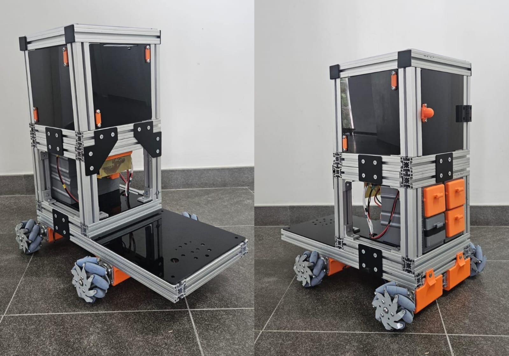

Open MICKY
===========

[](https://github.com/fbot-research/Open_MICKY) [](https://instagram.com/furgbot)

---

<div style="text-align: justify;">
  O alto custo das plataformas comerciais de robôs móveis ainda representa uma barreira significativa para equipes que desejam ingressar em ambientes competitivos e de pesquisa, como o RoboCup@Work, especialmente em regiões com recursos limitados, como a América Latina. Essa barreira frequentemente restringe a participação e desacelera o desenvolvimento de novas soluções em robótica.

  O MICKY foi desenvolvido para enfrentar esse desafio, oferecendo uma base móvel omnidirecional de baixo custo e de código aberto, projetada para ser modular e mecanicamente robusta. A plataforma segue uma filosofia de design semelhante à de outras bases robóticas acessíveis, com foco em permitir que novas equipes e pesquisadores ingressem na área de robótica móvel.

  O sistema adota uma arquitetura modular baseada em perfis de alumínio com ranhura em T de 40×40, combinados com um sistema de tração por rodas Mecanum, possibilitando movimento holonômico completo enquanto suporta cargas úteis significativas.

  Em vez de depender de soluções proprietárias caras, o MICKY é construído utilizando componentes comerciais prontos para uso (COTS) e um design mecânico simplificado. Essa abordagem permite uma alta relação carga útil/custo, mantendo a facilidade de montagem, manutenção e customização.

  A plataforma é projetada para suportar aplicações como manipulação móvel, navegação autônoma e pesquisa em robótica, além de permitir a integração direta de sensores, atuadores e subsistemas adicionais.

  Por fim, o MICKY tem como objetivo democratizar o acesso à robótica móvel, oferecendo uma plataforma escalável, reproduzível e economicamente viável para estudantes, pesquisadores e equipes de robótica.
</div>



---

```{toctree}
:maxdepth: 2
:caption: Contents:

hardware/index
software/index
```